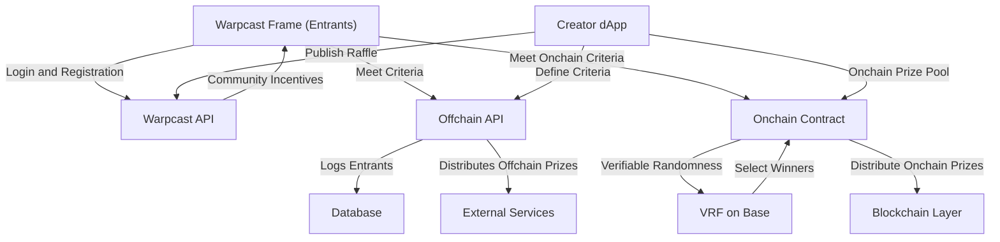

# Technical Architecture

The Rafflecast system integrates offchain and onchain components to provide a seamless raffle experience for both creators and entrants. The architecture comprises:

1. Frontend:
   * Warpcast Frame for entrants, handling user registration, criteria verification, and participation tracking.
   * Creator dApp for raffle setup, management, and publishing to Warpcast channels.
2. Backend Services:
   * Manages offchain criteria, logs activity, and handles offchain prize distribution.
   * Facilitates communication between Warpcast APIs, the database, and blockchain components.
3. Blockchain Layer:
   * Implements verifiable random selection (VRF) and enforces onchain criteria.
   * Handles onchain prize pools and distribution for winners.
4. Interactions:
   * Creator to System: Setup, publish, and manage raffles through the dApp.
   * Entrant to System: Join raffles via the Warpcast Frame, verify criteria, and monitor raffle progress.
   * System to Blockchain: Onchain validation, prize distribution, and random winner selection.

This architecture ensures scalability, fairness, and a smooth user experience, leveraging Warpcast integrations and Base rollup smart contracts.

### Selection and Settlement:

The system will utilize a verifiable random function (VRF) for random selection of raffle winners. Whenever possible, existing onchain VRF solutions will be integrated to leverage their reliability and composability, accelerating the deployment process.

