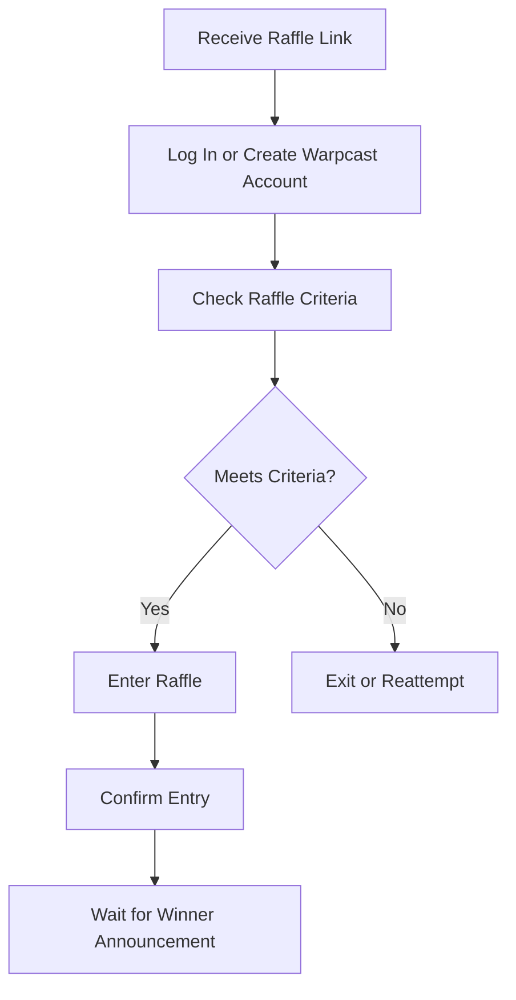

# 2. Entrant's Workflow

## Flow Diagram

## Flow Description

1. Discover the Raffle\
   The entrant encounters the raffle through various means:
   * Shared on Warpcast Channel: The raffle is shared in a Warpcast channel, where the entrant can see the details and participate.
   * Shared on X/Twitter: The creator shares the raffle link on social media platforms like X/Twitter. The link redirects the entrant to the raffle page within Warpcast.
2. Login or Create Warpcast Account
   * Existing Account: If the entrant already has a Warpcast account, they are prompted to log in. This step ensures their identity is verified and their wallet is connected for registration.
   * &#x20;New Account Creation: If the entrant does not have a Warpcast account, they are prompted to create one. As an incentive, they can receive an extra entry into the raffle if they join the creator’s community or channel after signing up.
3. Meet Raffle Criteria\
   Once logged in, the entrant is automatically checked against the raffle’s criteria, which may include:
   * Token Ownership: The entrant must own specific tokens or NFTs.
   * Social Media Actions: The entrant may need to follow particular accounts, recast, or like specific casts (tweets).
   * Channel Membership: The entrant must be a member of a particular Warpcast channel or community.
   * Additional Criteria: Other criteria may include joining a community, participating in specific events, or completing tasks.
4. Confirm Eligibility and Enter the Raffle
   * Eligible Entrants: If the entrant meets all the criteria, they are confirmed as eligible and allowed to enter the raffle.
   * Ineligible Entrants: If the entrant does not meet the criteria, they are shown a message explaining why they are not eligible and are not able to enter the raffle. The entrant can then try to fulfil the conditions and reapply.
5. Participate and Engage\
   Once entered, the entrant can:
   * Track the Raffle: The entrant can view the raffle status and wait for the closing date.
   * Engage with the Raffle: They can follow the raffle’s progress, like, or share it with others to increase their chances of winning (if applicable, based on the raffle’s rules).
6. Winner Announcement\
   After the raffle closes, the winner is selected via the onchain Verified Random Function (VRF). The entrant is notified if they win, with the reward being distributed as per the raffle rules (onchain or offchain).
   * Onchain Reward: If the entrant wins an onchain prize (such as tokens or NFTs), it is automatically transferred to their wallet.
   * Offchain Reward: If the prize is offchain, the entrant is informed of how they will receive it (e.g., through a manual prize distribution process).
